# Ex-04-EDA
# AIM:
To perform EDA on the given data.
# EXPLANATION:
The primary aim with exploratory analysis is to examine the data for distribution, outliers and anomalies to direct specific testing of your hypothesis.
# ALGORITHM:
# STEP 1:
Import the needed packages.
# STEP 2:
Using data cleaning method remove all the null values.
# STEP 3:
Detect and remove all outliers.
# STEP 4:
Find the pairwise correlation of all columns in the dataframe.corr()).
# STEP 5:
Save the final data set into the file.

# CODE:
```
import pandas as pd 
import numpy as np 
import seaborn as sns 
df=pd.read_csv("supermarket.csv")
df

df1=df.copy()
df1.drop("Branch",axis=1,inplace=True)
df1.drop("City",axis=1,inplace=True)
df1.drop("Customer type",axis=1,inplace=True)
df1.drop("Gender",axis=1,inplace=True)
df1.drop("Product line",axis=1,inplace=True)
df1.drop("Payment",axis=1,inplace=True)
df1.drop("Date",axis=1,inplace=True)
df1

df1.boxplot()

cols = ['Tax 5%', 'Total','gross margin percentage','gross income']
Q1 = df[cols].quantile(0.25)
Q3 = df[cols].quantile(0.75)
IQR = Q3 - Q1
df = df[~((df[cols] < (Q1 - 1.5 * IQR)) |(df[cols] > (Q3 + 1.5 * IQR))).any(axis=1)]
df

df.boxplot()

df["Payment"].value_counts()
df["Gender"].value_counts()
df["Quantity"].value_counts()
df["Branch"].value_counts()
df["City"].value_counts()
df["Customer type"].value_counts()
df["Product line"].value_counts()

sns.countplot(x="Payment",data=df)
sns.countplot(x="Gender",data=df)
sns.countplot(x="Quantity",data=df)
sns.countplot(x="Branch",data=df)
sns.countplot(x="City",data=df)
sns.countplot(x="Customer type",data=df)
sns.countplot(x="Product line",data=df)

sns.displot(df["Unit price"])
sns.displot(df["Tax 5%"])
sns.displot(df["Total"])
sns.displot(df["cogs"])
sns.displot(df["gross income"])

sns.countplot(x="Customer type",hue="Quantity",data=df)
sns.countplot(x="Customer type",hue="City",data=df)
sns.countplot(x="Product line",hue="Customer type",data=df)
sns.countplot(x="Customer type",hue="Gender",data=df)
sns.countplot(x="Product line",hue="Branch",data=df)
sns.countplot(x="Customer type",hue="Payment",data=df)

pd.crosstab(df["Gender"],df["Customer type"])
pd.crosstab(df["Payment"],df["Customer type"])

sns.displot(df[df["Gender"]=='Male']["gross income"])
sns.displot(df[df["Gender"]=='Female']["gross income"])

df.corr()

df1.drop('gross margin percentage',axis=1,inplace=True)
sns.heatmap(df.corr(),annot=True)
```
# OUTPUT:
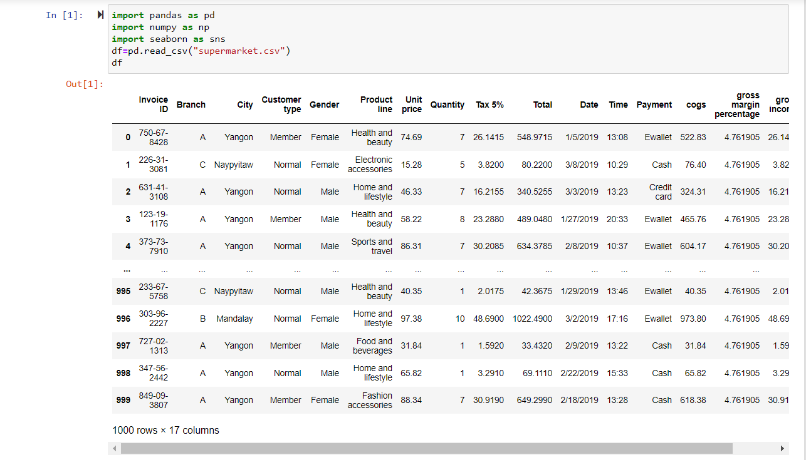
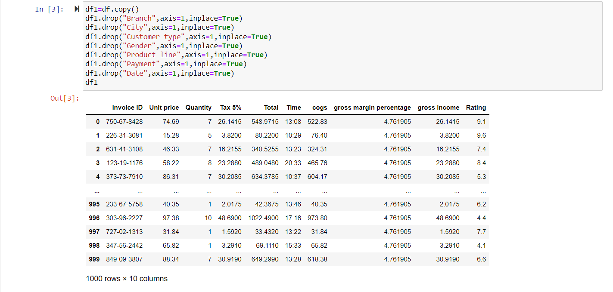
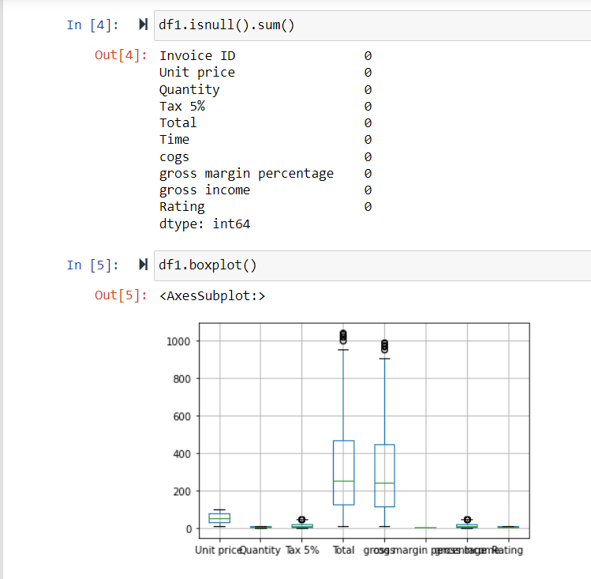
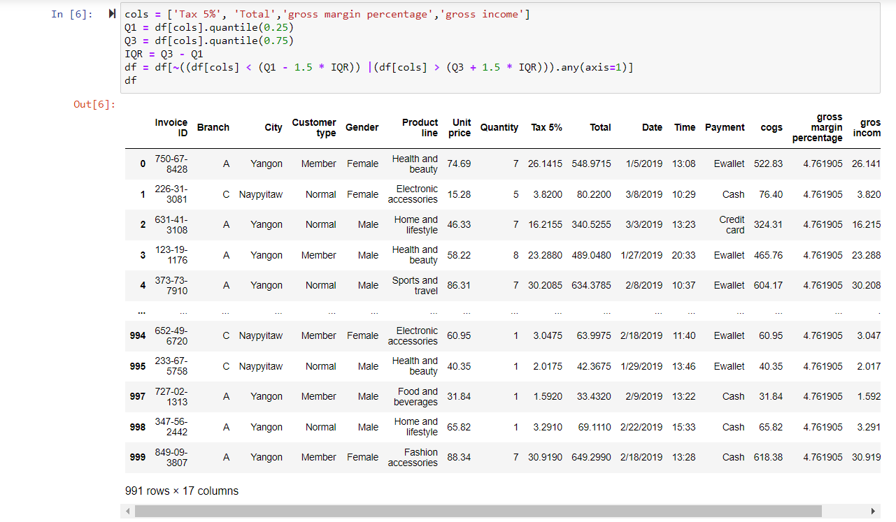
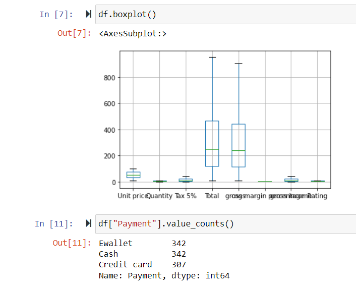
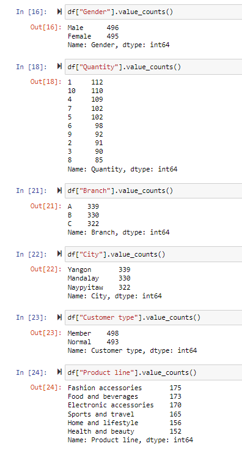
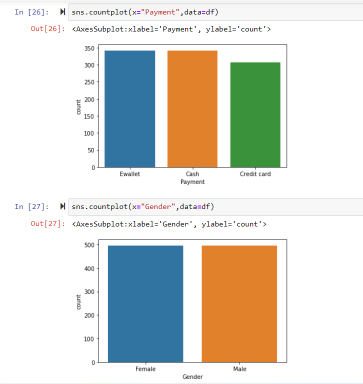
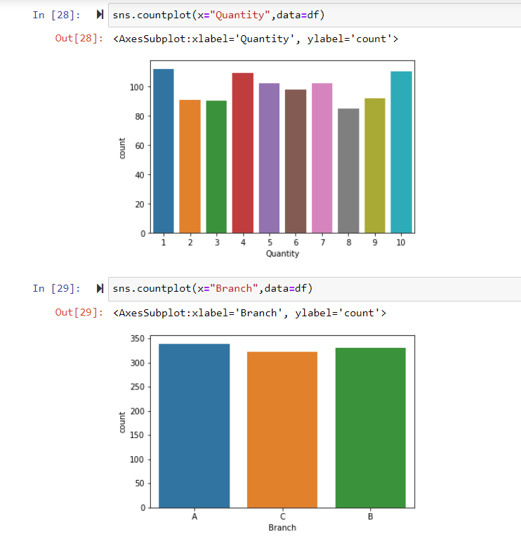
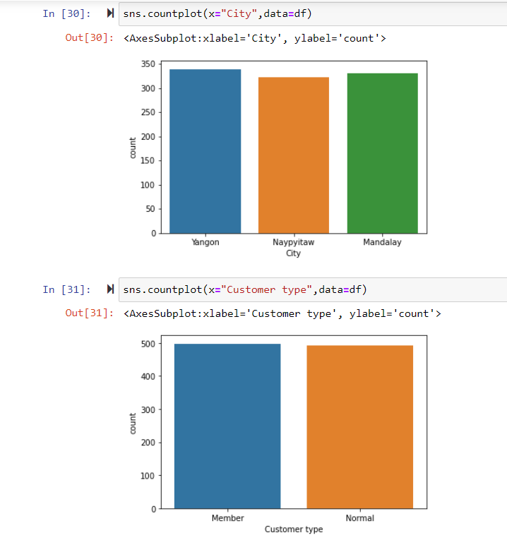
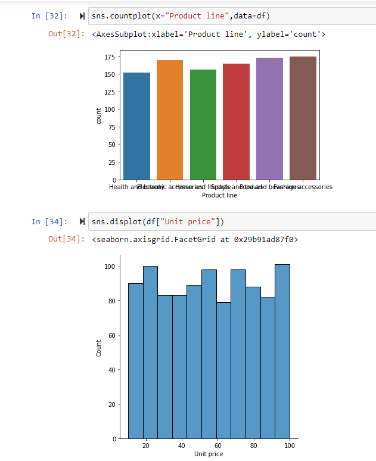
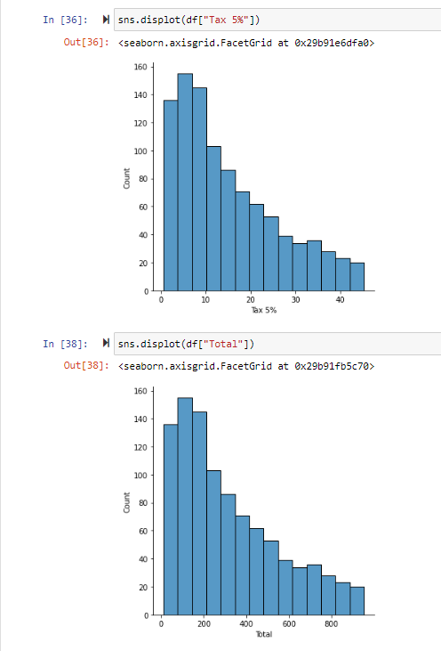
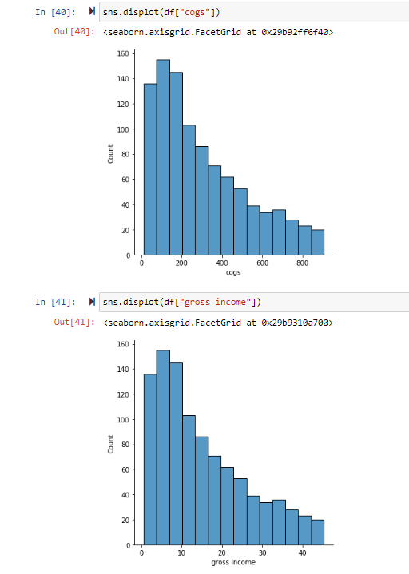
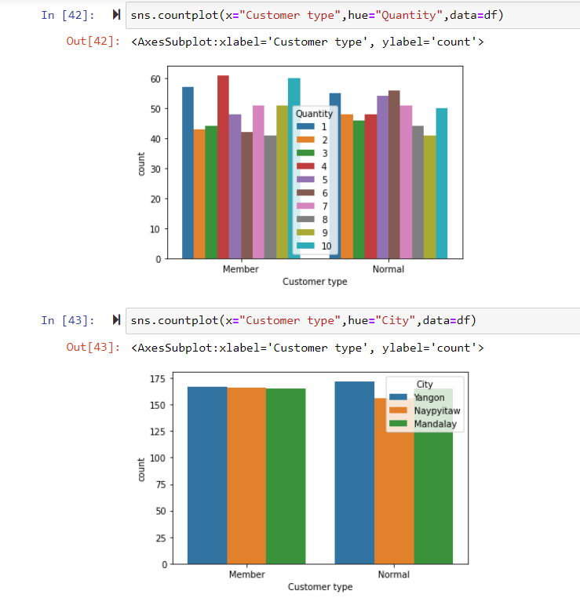
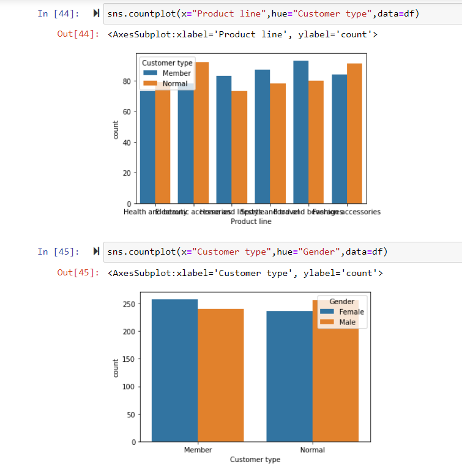
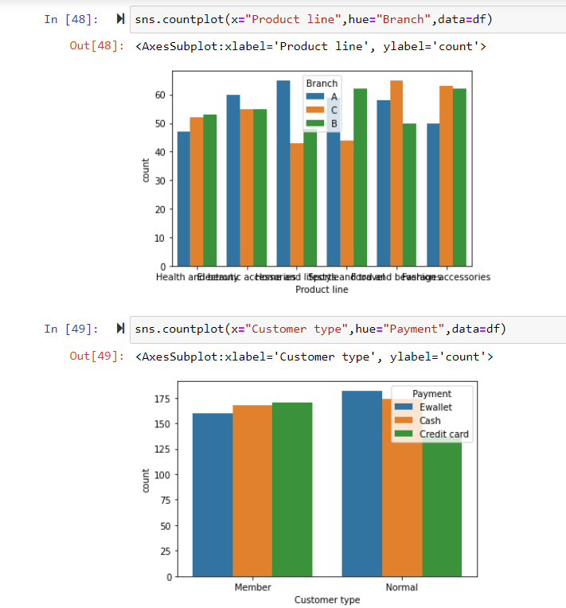
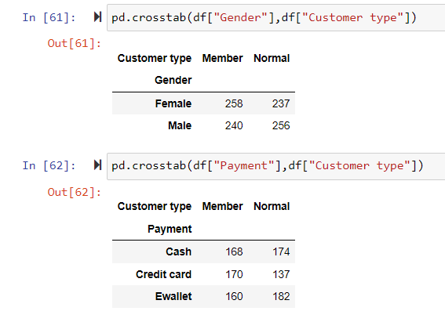
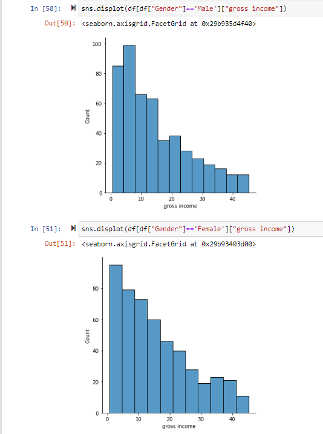
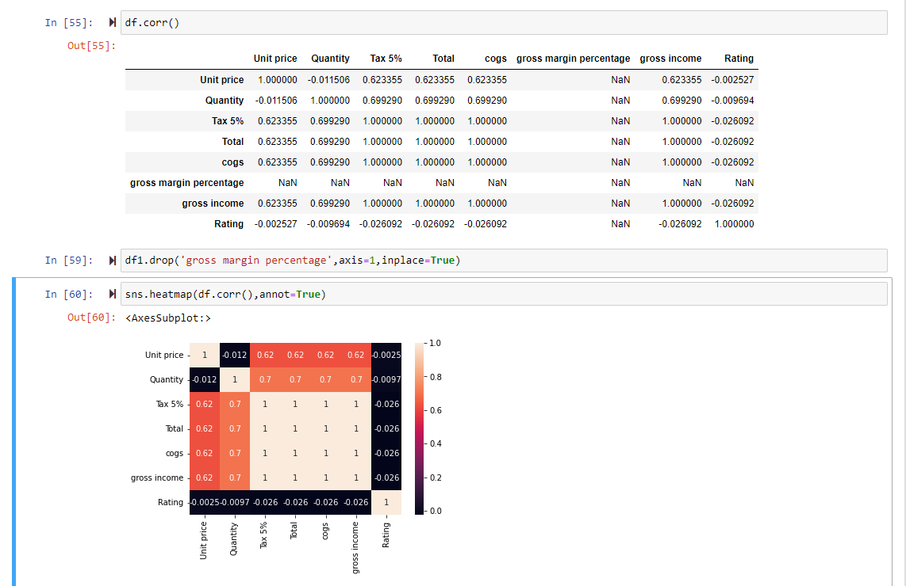

# RESULT:
The data has been cleaned, outlier has been removed and the EDA on the given data has been performed.